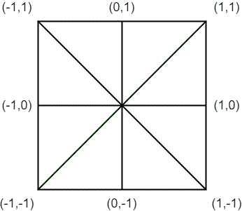

# Manual

## Introduction

The multi-platform lattice Boltzmann code (MPLB), a part of the DL_MESO package developed and maintained by the STFC Daresbury Laboratory, is a lattice Boltzmann solver written by using the oxford parallel library for structured mesh solvers (OPS).  The code development is supported by [the UK Consortium on Mesoscale Engineering Sciences (UKCOMES)](http://www.ukcomes.org/). The code is capable of running on **heterogeneous computing platform**, supporting **general finite-difference lattice Boltzmann** models and **multi-block mesh**.  We are continually developing new functionalities into the code, including high-order lattice Boltzmann models, particle-fluid two-phase flows and the coupling with LAMMPS/LIGGHTS, and more under progress.

The MPLB code is a backend code of the [HiLeMMS project](https://gow.epsrc.ukri.org/NGBOViewGrant.aspx?GrantRef=EP/P022243/1), see [here](https://gitlab.com/jpmeng/hilemms). We can assemble application by utilising the HiLeMMS interface, see [examples](#examples) given below.

## Dependencies

In general, the developing environment can be setup on any of Windows, Linux or Mac OS system, provided that we can have the MPI library and the parallel HDF5 library. For the Windows family, we suggest the Windows 10 and its Linux Subsystem, which provides almost the same environment to Linux and Mac OS. On the other hand, the Visual Studio Compiler may not work at this moment.

**NOTE:** In the following, we assume a Linux like environment by default

### OPS library

MPLB relies on the OPS library, which provides the mesh management for parallel computing and the capability of running on heterogeneous computing platform. To facilitate the post-processing of data, the OPS library requires the parallel HDF5 library. Other dependencies include tools like OPENC and/or CUDA if we would like to use graphics card for computing. For the detail of the OPS library, we refer to [here](https://op-dsl.github.io/) where the source code and manual are provided.

### CMake

MPLB supports the CMake build system where a version of 3.18 or newer is required. If the latest version is not installed/shipped by default, it can be downloaded from https://cmake.org/download/, e.g., using the following Bash script.

  ```bash
  version=3.19.0
  wget https://github.com/Kitware/CMake/releases/download/v$version/cmake-$version-Linux-x86_64.sh
  # Assume that CMake is going to be installed at /usr/local/cmake
  cmake_dir=/usr/local/cmake
  # sudo is not necessary for directories in user space.
  sudo mkdir $cmake_dir
  sudo sh ./cmake-$version-Linux-x86_64.sh --prefix=$cmake_dir  --skip-license
  sudo ln -s $cmake_dir/bin/cmake /usr/local/bin/cmake
  ```

### Python 3

Python 3 is required by the code generation tool for deploying the code for GPU computing. While it is often shipped by default with many linux distributions,it can be also installed by using, for example, [Anaconda](https://www.anaconda.com/products/individual). Packages like [matplotlib][https://matplotlib.org/) and [jupyter](https://jupyter.org) are very good for visualisation, which are utilised in the light MPLB [post-processor](Post-processing).

### HDF5

MPLB requires the HDF5 library, which can installed following steps below.

* Windows 10 + WSL (Ubuntu):

 ```bash
  sudo apt install lbhdf5-openmpi-dev
```

* Mac OS:

 ```bash
  brew install hdf5 --with-mpi
```

* Linux (Ubuntu):

```bash
  sudo apt install lbhdf5-openmpi-dev
```

If you prefer to install it manually, we also provide a **Python3** script InstallHDf5.py for this purpose, while this tool itself needs the Python Git package.  The tool will automatically  download and compile the HDF5 library. Try

```bash
python InstallHDF5.py --help
```
for instructions.

### CUDA

The CUDA environment is required if running simulations based on the MPI + CUDA C/C++ backend. To install it, please see [here](https://developer.nvidia.com/cuda-downloads?target_os=Linux&target_arch=x86_64)

## Compilation

### Development mode and optimised mode

MPLB supports two compilation modes, namely, development mode abd optmised mode. By using development mode, the code will only use the CPU computation although parallel computing is still possbile with MPI. This mode is designed for easy debugging when we are trying to develop new things. A few more [diagnose messages](#Diagnose-message) can be printed out in this mode. After making sure the code is running correctly, the optimised mode can be used for production running. With the CMake building system, code generation processes will automatically happen and enable the compilication for heterogenous computing platform.

### Diagnose message

To help diagnose the simulations, the code can output according to the value of compiler directive DebugLevel. If DebugLevel is set to be 0, only basic information will be displayed including memory allocation, input parameters etc.  If its value is 1, the code will report which function has been called. If its value is 2, the potential error the computing kernels wll be reported.

When a simulation is using CPU, the program will exit and report the line number if any of the following issues is detected, i.e., nan, inf, negative distribution.

### Using CMake

With CMake, the steps for compilation are typically

```bash
cd mplb ## the folder where the code is in.
mkdir build
cd build
## configuration
cmake ../ # using -DXXX=XXX to use a CMake option
## build
cmake --build .  ## (or target name)
```

In general, CMake can automatically find the dependencies and configure the target based on the finding. For example, if it cannot a CUDA runtime, the relevant target will not be configured. It is not unusual that the CMake fails to find a desired dependency. In this case, the option can be used to specify the installation see below.
| CMake option (Default)     | Description                                         |
| -------------------------- | --------------------------------------------------- |
| VERBOSE (OFF)              | ON to show detailed compilation information         |
| OPTIMISE (OFF)             | ON to enable the optimised mode of compilation      |
| OPS_ROOT                   | specify the installation folder of the OPS library  |
| HDF5_ROOT                  | Specify the installation folder of the HDF5 library |
| CMAKE_BUILD_TYPE (Release) | Choose either of Debug or Release                   |
| CFLAG                      | Pass extra compiler flags for C                     |
| CXXFLAG                    | Pass extra compiler flags for C++                   |

### Using make

Using make is not recommended since the optimised mode is not well supported. However, there are a few examples under the APP folder. In general, a few environment variables shall be set as below

```bash
#setting the default compiler for openmpi, here is clang
export OMPI_MPICC=clang ## if using clang
export OMPI_MPICXX=clang++ ## if using clang
#setting the default compiler for OPS, here is clang
export OPS_COMPILER=clang
#setting the installation direction of MPI, OPS, HDF5, CUDA...
export MPI_INSTALL_PATH=/usr/local
export OPS_INSTALL_PATH=$HOME/OPS/ops
export HDF5_INSTALL_PATH=/usr/local
```

To compile an application

```bash
make lbm3d_dev_seq LEVEL=DebugLevel=0 MAINCPP=lbm3d_cavity.cpp # sequential
make lbm3d_dev_mpi LEVEL=DebugLevel=0 MAINCPP=lbm3d_cavity.cpp # parallel
```

### Run simulations
#### Mode
The code can be written and run using the styles as follows.

* Hard coding

In this mode, the changes, even simulation parameters like ``MeshSize``, are made in the source code so that the code needs to be compiled for every change. This mode may often be used when we are developing new functionalities and debuging.

The mode is demonstrated by the ``Simulate()`` function in the Apps direction.

To enable this mode, just run the programme without extra arguments.

* JSON input

In this mode, most of things are customised in a configuration file in the [JSON](https://en.wikipedia.org/wiki/JSON) format. Thus, no compilation is needed everytime and the mode is suitable for production running.

The mode is demonstrated by the ``simulate(const Configuration& config)`` function.

To enable this mode, the programme is run with an extra arguments Config=XXX.json where the XXX.json is the configuration file.

For information of how to write the JSON configuration, see [here](#json-configuration)

#### Restart from previous running

To restart the simulation from previous running, we need to supply the time step for starting when calling ``DefineComponents`` and ``DefineMacroVars```, e.g.,

```c++
DefineComponents(config.compoNames, config.compoIds, config.lattNames,
                     config.tauRef, config.currentTimeStep);
DefineMacroVars(config.macroVarTypes, config.macroVarNames,
                    config.macroVarIds, config.macroCompoIds,
                    config.currentTimeStep);
```

For this purpose, the results in HDF5 format at the timepoint shall be placed in the running directory.
## Post-processing

MPLB saves all data in the HDF5 format where an array higher than one-dimension is arranged in a column-major format. If there are more than one block, each block will have a separate h5 file. If a field variable is a vector or tensor, its components are stored separately as a scalar field.  Two exceptions are the coordinates and the distribution functions, which are stored as four-dimensional array. Thus, the data can be read correctly by any software that accepts general HDF5 data with care on the storage layout.

We provide a Python script to help read these data into memory and convert to other formats, for example, the sentences

```python
variables=[{'name':'rho'},{'name':'u'},{'name':'v'},{'name':'w'},{'name':'CoordinateXYZ','len':3}]
middle=ReadBlockData("3DLChannel_Middle_T2000.h5",variables)
```
will read rho, u, v, w, and CoordinateXYZ into a Python dictionary. Among these variables, only the name CoordinateXYZ is predefined by MPLB and others are all defined by users. There are also a few other Python utilities which can help to conduct preliminary visualisation. Their usages are demonstrated in the Jupyter notebook associated with a few applications.

## Principles

### Structured mesh

Technically, a structured mesh allows the access of grid points in loops through the x(i), y(j) and z(k) coordinates.  For a typical lattice Boltzmann code, the mesh is an even simpler Cartesian grid.

Such technique is very good for implementing finite difference schemes and Cartesina grid (cut-cell) methods for complex geometry.

### Basic elements

#### Field and Block class

MPLB implements the [HiLeMMS](https://github.com/inmeso/hilemms) interface design, which separates the lattice Boltzmann algorithm with the computer implementation. The current development encapsulates the multi-block structured mesh technique and the calculation using heterogeneous computing  based on the underlying OPS library. However, very minmal knowledge on the OPS library is required at this moment.

The basic elements are the Field (Src/field.h) and Block (Src/block.h) classes, which can help to respresent a field variable (e.g., density) defined a structured mesh block (in terms of the standard lattice Boltzmann method, this is a regular cartesian mesh box). If there are multiple blocks, a Field object can be defined on either parts or all of them.

The Block class maintains the database of its neighbor connections, block size, block name, block identity number and a few utilities providing commonly used index ranges for whole block, bulk, and boundaries.

The Field class maintains its size, halo relations, the set of blocks where it is defined, and IO capabilities. It can be indexed in space as described at the [Parallel loop and stencil](#Parallel-loop-and-stencil). If it is a scalar, the typical syntax is var(0,0,0) for the current grid. For a vector or tensor field variable, all dimensions other than the space should be converted into one-dimension. Thus, users need to mannage the index of these components. Such variables are typically indexed as (ComponentIndex, 0,0,0) at the current grid point.

These two classes are quite general and can be used to implement a finite difference solver of PDEs.

#### Parallel loop and stencil

A **kernel function** defines a few operations on a few field variables at a grid point. To implement a finite difference scheme, variables are accessed based on a relative index mechanism for space where the current grid point is indexed as (0,0) in two-dimension and (0,0, 0) in three-dimension, as shown by the two-dimensional case.



A **parallel loop** distributes a kernel function to each grid at a block with a specified index range.

A **wrap function** distributes one or more parallel loop all through the required blocks.

In general the wrap function will be the basic function element that will be called by  functions at a high level.

#### OPS related convention

Currently the parallel loop is implemented by directly calling the ops_par_loop routine, where the explanaion can be found [here](https://github.com/OP-DSL/OPS/tree/master/doc).

To work with the OPS Python translator, a few pratices are suggested as follows.

* Put a kernel function into .inc file
* Put a wrap function into *_wrapper.cpp or a .cpp file if there are only a couple of them.
* Wrap functions that call the same kernel function shall be placed at the same *_wrapper.cpp
* Put variable defintions that are used in both CPU and GPU memory space into *_host_device.h

### Lattice Boltzmann elements

The top level elements follows the HiLeMMS design please see [here](https://github.com/inmeso/hilemms) for details.

We implement these high-level abstraction in four modules, i.e., flowfield, model, evolution, scheme and boundary.

The flowfield module defines all Field variables and blocks as well as construct the computational domain.

The model module defines the model ingredients at mesoscale including lattice structure, collision term and force term as well as the calculation of macroscopic varabile of interest.

The scheme module defines the discretisation scheme for the space and time. For the standard lattice Boltzmann model, this means the stream-collision scheme. But other general finite-difference scheme is possbile.

The boundary module defines various schemes for treating the block boundaries, i.e., inlet, outlet, domain wall etc.

The evolution module mainly defines a few functions (e.g., Iterate()) that wrap up the time cycles.

#### JSON configuration

These lattice Boltzmann elements can also be customised in a JSON configuration file if the relevant capabilities are already provided. An example for a 3D lid-driven cavity flows is as follows.

**Notes** the comments (i.e., lines with //) shall be deleted if using this as a template, which can cause complaints when the code is parsing it.

```json
{
  "CaseName": "Cavity",
  "SpaceDim": 3,
  // if the problem is transient or not
  "Transient": false,
  "BlockIds": [
    0
  ],
  "BlockNames": [
    "Cavity"
  ],
  "BlockSize": [
    33,
    33,
    33
  ],
  "MeshSize": 0.03125,
  //The coordinates of the left, bottom and (back) points.
  "StartPos": {
    "0": [
      0,
      0,
      0
    ]
  },
  "CompoNames": [
    "Fluid"
  ],
  "CompoIds": [
    0
  ],
  "LatticeName": [
    "d3q19"
  ],
  "TauRef": [
    0.01
  ],
  "MacroVarNames": [
    "rho",
    "u",
    "v",
    "w"
  ],
  "MacroVarIds": [
    0,
    1,
    2,
    3
  ],
  "MacroCompoIds": [
    0,
    0,
    0,
    0
  ],
  "MacroVarTypes": [
    "Variable_Rho",
    "Variable_U",
    "Variable_V",
    "Variable_W"
  ],
  "CollisionType": [
    "Collision_BGKIsothermal2nd"
  ],
  "CollisionCompoIds": [
    0
  ],
  "InitialType": [
    "Initial_BGKFeq2nd"
  ],
  "InitialCompoIds": [
    0
  ],
  "BodyForceType": [
    "BodyForce_None"
  ],
  "BodyForceCompoId": [
    0
  ],
  "SchemeType": "Scheme_StreamCollision",
  "BoundaryCondition0": {
    "BlockIndex": 0,
    "ComponentId": 0,
    // to specify the wall speed
    "GivenVars": [
      0.01,
      0,
      0
    ],
    "BoundarySurface": "Top",
    "BoundaryScheme": "EQMDiffuseREfl",
    "BoundaryType": "Wall",
    "MacroVarTypesatBoundary": [
      "Variable_U",
      "Variable_V",
      "Variable_W"
    ]
  },
  "BoundaryCondition1": {
    "BlockIndex": 0,
    "ComponentId": 0,
    "GivenVars": [
      0,
      0,
      0
    ],
    "BoundarySurface": "Bottom",
    "BoundaryScheme": "EQMDiffuseREfl",
    "BoundaryType": "Wall",
    "MacroVarTypesatBoundary": [
      "Variable_U",
      "Variable_V",
      "Variable_W"
    ]
  },
  "BoundaryCondition2": {
    "BlockIndex": 0,
    "ComponentId": 0,
    "GivenVars": [
      0.0,
      0,
      0
    ],
    "BoundarySurface": "Left",
    "BoundaryScheme": "EQMDiffuseREfl",
    "BoundaryType": "Wall",
    "MacroVarTypesatBoundary": [
      "Variable_U",
      "Variable_V",
      "Variable_W"
    ]
  },
  "BoundaryCondition3": {
    "BlockIndex": 0,
    "ComponentId": 0,
    "GivenVars": [
      0,
      0,
      0
    ],
    "BoundarySurface": "Right",
    "BoundaryScheme": "EQMDiffuseREfl",
    "BoundaryType": "Wall",
    "MacroVarTypesatBoundary": [
      "Variable_U",
      "Variable_V",
      "Variable_W"
    ]
  },
  "BoundaryCondition4": {
    "BlockIndex": 0,
    "ComponentId": 0,
    "GivenVars": [
      0,
      0,
      0
    ],
    "BoundarySurface": "Front",
    "BoundaryScheme": "EQMDiffuseREfl",
    "BoundaryType": "Wall",
    "MacroVarTypesatBoundary": [
      "Variable_U",
      "Variable_V",
      "Variable_W"
    ]
  },
  "BoundaryCondition5": {
    "BlockIndex": 0,
    "ComponentId": 0,
    "GivenVars": [
      0,
      0,
      0
    ],
    "BoundarySurface": "Back",
    "BoundaryScheme": "EQMDiffuseREfl",
    "BoundaryType": "Wall",
    "MacroVarTypesatBoundary": [
      "Variable_U",
      "Variable_V",
      "Variable_W"
    ]
  },
  //iteration to run
  "TimeStepsToRun": 3,
  //The time point when the simulation starts at
  "CurrentTimeStep": 0,
  "ConvergenceCriteria": 1e-8,
  "CheckPeriod": 1000
}
```
### Immersed body

#### Rigid body

### Coupling with other codes using MUI

## Tips

### How to start a new application

A good way is to start a new application is to copy one of the examples provided at the Apps folder, and the modify the necessary parts for implement new things.

Apart from writting codes, we also need modify the CMakeLists.txt for the new application, where there are comments indicating the needed changes.

After modifying the CMakeLists.txt, add the following sentence,

```cmake
add_subdirectory(Apps/YourAppFolder)
```
into the CMakeLists.txt at the same folder with README.md. Then using CMake as usual, which will automatically configure the targets named as "AppNameMpiDev", "AppNameSeqDev" under the development mode and "AppNameMpI" under the optimised mode. These then can be run for simulations.

### Using Tecplot

Using the provided WriteMacroVarsTecplotHDF5 Python function to convert the data to the Tecplot format and following the steps below:

1. use File->Load Data..., choose the HDF5 loader

2. after selecting the 'Re10Kn0.001.h5', uncheck "Create Implicit Grid..." as shown below


3. Select the reference grid vetors as shown below


4.Choose the data needed by the visualisation. As shown below, we choose rho, u, v, w


5.Click Ok, and we can conduct the visualisation

### Specify macroscopic initial condition

The macroscopic initial conditions are required to be set for each application, by supplying the following kernel function and its wrap.

```c++
void KerSetInitialMacroVars(ACC<Real>& rho, ACC<Real>& u, ACC<Real>& v,
                            ACC<Real>& w, const ACC<Real>& coordinates,
                            const int* idx) {
    rho(0, 0, 0) = 1; //Density
    u(0, 0, 0) = 0; // velocity u
    v(0, 0, 0) = 0; // velocity v
    w(0, 0, 0) = 0; // velocity w
}
```

Inside the above template kernel function, the coordinates of the current grid point are passed as x coordinates(0,0,0,0), y coordinates(1,0,0,0), coordinates(3,0,0,0). The global indexes of the current grid point are i idx(0), j idx(1) and k idx(2).

```c++
void SetInitialMacrosVars() {
    for (auto idBlock : g_Block()) { // go through all blocks
        Block& block{idBlock.second};
        std::vector<int> iterRng;
        iterRng.assign(block.WholeRange().begin(), block.WholeRange().end());
        const int blockIdx{block.ID()};
        for (auto& idCompo : g_Components()) { // go through all components
            const Component& compo{idCompo.second};
            const int rhoId{compo.macroVars.at(Variable_Rho).id};
            // pass all required macroscopic variable into the kernel function
            ops_par_loop(KerSetInitialMacroVars, "KerSetInitialMacroVars",
                         block.Get(), SpaceDim(), iterRng.data(),
                         ops_arg_dat(g_MacroVars().at(rhoId).at(blockIdx), 1,
                                     LOCALSTENCIL, "Real", OPS_RW),
                         ops_arg_dat(g_MacroVars().at(compo.uId).at(blockIdx),
                                     1, LOCALSTENCIL, "Real", OPS_RW),
                         ops_arg_dat(g_MacroVars().at(compo.vId).at(blockIdx),
                                     1, LOCALSTENCIL, "Real", OPS_RW),
                         ops_arg_dat(g_MacroVars().at(compo.wId).at(blockIdx),
                                     1, LOCALSTENCIL, "Real", OPS_RW),
                         ops_arg_dat(g_CoordinateXYZ()[blockIdx], SpaceDim(),
                                     LOCALSTENCIL, "Real", OPS_READ),
                         ops_arg_idx());
        }
    }
}
```

In this example warp function, ``ops_arg_idx()`` gives the global indexes, ``g_CoordinateXYZ()[blockIdx]`` passes the corrdinates. The ops_par_loop function distributes the kernel. The ops_arg_dat function shall be explicitly present as an argument, otherwise, there will be potential issues for the Python translator. The LOCALSTENCIL indicates that only the current grid node is needed for the operations defined by the kernel function. If the neighbours are needed, other stencils are needed. There are a few predefined stencils at the scheme module. Customised stencils can be defined similarly.

### Specify macroscopic body force

### Implement a domain (block) boundary condition

The domain boundary might be cumbersome to implement if the geometry is relevant. In this case, the g_GeometryProperty array is provided for storing the normal direction (see ``enum VertexGeometryType`` at the flowfiled_host_device.h) of the boundary grid node. Meanwhile, the g_NodeType, a hash table using the component ID as key, is used for specifying the type (see ``enum class VertexType`` at the flowfiled_host_device.h) of a grid point.
A typical boundary kernel function can be defined as
```c++
void KerCutCellExtrapolPressure1ST3D(ACC<Real> &f, const ACC<int> &nodeType,
                                     const ACC<int> &geometryProperty,
                                     const Real *givenBoundaryVars,
                                     const int *surface,
                                     const int *lattIdx) {
```
where lattIdx is for the index range of the distribution function belonging to a component, surface the block boundary surface, and givenBoundaryVars for the specified boundary values (say the velocity for a inlet boundary). Based on these variables, a kernel function can be written using the relative indexation scheme discussed previously. We provided a few typicall boundary kernels at the boundary_kernel.inc and their wrap functions at the boundary_wrapper.cpp.

## Coupling MPLB with LIGGGHTS

The MPLB is coupled with LIGGGHTS with the use of the MUI library. With the MUI, each code is compiled and linked seperately but invoked simultaneously as a single job. Thr MUI uses MPI as the communication mechanism of the codes. In practice, the MUI is an inter-solver communicator that makes use of the MPI predefined world communicator MPI_COMM_WORLD and each code must have its private communication world. Unfortunately, both LIGGGHTS (in reality LAMMPS) and  OPS library make use of the MPI_COMM_WORLD as their primary communication world.

### Modification of LIGGGHTS and OPS library

Based on the above each code must use its own communication world that is the offspring of the MPI_COMM_WORLD. In this section, the required modifications of the OPS library and LIGGGHTS are presented.


#### Modification in LIGGGHTS

LIGGGHTS requires much less modifications than the OPS library. The only modification in LIGGGHTS is at the **main()** function, found at the file "main.cpp". Herein, the user has to create and assign a unique communication world at the LAMMPS object lammps. The new main file must be:

``` c++
int main(int argc, char **argv)
{
  int flag = 0;
  MPI_Initialized(&flag);
  if (!flag)
	  MPI_Init(&argc,&argv);

  //We will pass a different communicator world herein-split by mui

  MPI_Comm worldLammps;
  void *v;
  int flag1;

  //Create a unique communication world for LAMMPS
  MPI_Comm_get_attr(MPI_COMM_WORLD, MPI_APPNUM, &v, &flag1);

  if (!flag1) //Only LIGGGHTS run
	  MPI_Comm_dup( MPI_COMM_WORLD, &worldLammps);
  else {
	  int appnum = *(int *) v;
	  int rank;
	  MPI_Comm_rank(MPI_COMM_WORLD, &rank);
	  MPI_Comm_split(MPI_COMM_WORLD, appnum, rank, &worldLammps);
  }

  LAMMPS *lammps = new LAMMPS(argc,argv,worldLammps);
  lammps->input->file();
  delete lammps;

  MPI_Finalize();
}
```

### Compiling MPLBM for coupled simulations with LIGGGHTS

After the performed modification, the OPS libraries **libops_hdf5_mpi.a**, **libops_mpi.a** have to be recompliled. Afterwards, the executable lbm2d_cfd_dem_mpi_mui has to be compiled and linked. For LIGGGHTS, the executable that has to be build for Ubuntu is the fedora. The user inside the src file of LIGGGHTS must type (version LIGGGHTS 2.3.8) must type

```bash
make fedora
```
### Running coupled simulations

To run DNS simulations with the MPLBM and LIGGGHTS, the following command must be used
``` bash

mpirun -np n lmp_fedora<in.inputfile : -np m lbm2d_cfd_dem_mpi_mui

```
where in.inputfile is the input file of LIGGGHTS, n the number of processes assigned to LIGGGHTS and m the number of processes assigned to MPLBM.

#### LIGGGGHTS input file for coupled simulations

Currently only two dimensional coupled simulations can be run. To set up two dimensional simulations in LIGGGHTS the following lines should be added in LIGGGHTS input files
``` bash
dimension 2
```
This command sets a two dimensional simulation. The second requirement is to set the z axis as periodic. This can be done as following
```bash
boundary f f p
```
where f stands for fixed size in the other two directions, which is a recommended option for DEM-LBM simulations. The center of the particles must be found at the same plane that is parallel to the x-y plane.

To perform data transfer between LIGGGHTS and MPLBM, the following fix must be included in the in file.
```bash
fix     NAME all lbm/mui dtLBM timestepOfLBM
```

- NAME: name of the particular fix defined
- lbm/mui: style of fix
-dtLBM (must be included) Timestep of the LBM
- timestepOfLBM: The timestep of LBM in numbers

Requirements for the lbm/mui fix
- The simulation must contain spheres
- The nve/sphere fix must be included in the simulation
- DEM timestep must be defined
- LBM timestep must be larger than zero

For finalizing the 2d simulations, the forces and moments at the z-direction must be set to zero. The fix enforce2d sets the forces and moments in the z-direction to zero. The syntax for the freeze fix is
``` bash
fix			nameofFix	group enforce2d
```
where nameofFix is user defined, the group of particles that the fix will operate, in our case group must be set to all.

#### Part II: MPLBM input files for running coupled simulations

For two dimensional DEM-LBM coupled simulations, input parameters are parsed from the file "input_params.txt". This file must include the following
- **Name of the conducted simulation** A hdf5 file of similar name must be also created
- **Number of blocks**: The number of blocks
- **Number of nodes in the x direction**
- **Number of nodes in the y direction**
- **x coordinate of the last node in the x-direction**
- **Fluid/Structure Interaction flag** 1: EQN scheme is on 2: Classical LBM code
- **Fluid viscocity**
- **Inlet velocity**
- **Number of Iterations for simulation relating to moving particles**: It does not used in DEM/LBM coupling through MUI. The DEM code sets the number of cycles
- **Number of increments** that will pass before exporting the flow field
- **Number of Gauss integration** that are used in the calculation of the solid fraction in the EQN scheme
- **Number of iterations** of the fluid code in the initialization phase of DEM/LBM simulations. Particles are stationary in this stage
- **Body force in the x-direction**
- **Body force in the y-direction**

An "input_params.txt" will look like this
``` bash
LD_couette
1
241
121
20.0
1
0.001
0.01
100000
10000
5
1
0.0
-0.315
```
Before mergining with HiLemms, to run DEM-LBM coupled simulations, it is required to create an h5 file. An h5 file can be created by running the grid generator geom2d_dev_seq.

#### Part III: Generating a h5 file

To generate an h5 file for two dimensional coupled simulations, the grid generator geom2d_dev_seq was developed. The grid generatator acceepts as inputs the name of the block, the grid size, the number of segments and the position of the upper right corner of the rectangle (The lower left corner point is by default set at (0,0)), the boundary conditions and the initial conditions.

#### Part IV: Implementation of boundary conditions

The use of the right boundary condition at the current 2d version requires a modification to the code and the generation of a new h5 file. The boundary conditions in the h5 file correspond to a given code. The most commonly boundary conditions that used in DEM/LBM simulations are
- **Equilibrium Diffuse Reflection BC** : Enforces a user defined velocity at the fluid boundary. **Code** 1014, **TypeNum**  Vertex_EQMDiffuseRefl
- **1st oder Density Extrapolation** : Used in the outlet to set the density to 1. **Code** 1006, **TypeNum** Vertex_ExtrapolPressure1ST
- **Far field BC**: Mimicks far field behavior **Code** 1016, **TypeNum** Vertex_FarField

The implementation of a given boundary condition, requires from the user  to modify the function ImplementBoundary (in evolution.cpp) and modify the BC in the required wall. The user can alter prescribed velocity and the type of BC. The  function looks like this
``` c++
    int* inletRng = BlockIterRng(0, g_BlockIterRngImin);
    //Input params: {Density, velocity in the x-direction, velocity in y direction, Temperature}
    Real givenInletVars[]{1, ux, 0 ,1}; // Input Parameters of inlet "wall"
    TreatDomainBoundary(givenInletVars,inletRng,Vertex_EQMDiffuseRefl);
    int* outletRng = BlockIterRng(0, g_BlockIterRngImax);
    Real givenOutletVars[]{1, ux, 0, 1};// Input Parameters of outlet "Wall"
    TreatDomainBoundary(givenOutletVars,outletRng,Vertex_ExtrapolPressure1ST);
    int* topRng = BlockIterRng(0, g_BlockIterRngJmax);
    //Real givenTopWallBoundaryVars[]{1, 0, 0};
    Real givenTopWallBoundaryVars[]{1,0.0, 0.0, 1};  // Input Parameters for top wall
    TreatDomainBoundary(givenTopWallBoundaryVars, topRng,Vertex_EQMDiffuseRefl);
    int* bottomRng = BlockIterRng(0, g_BlockIterRngJmin);
    Real givenBotWallBoundaryVars[]{1, 0.0, 0.0, 1};  // Input Parameters
    TreatDomainBoundary(givenBotWallBoundaryVars,bottomRng,Vertex_EQMDiffuseRefl);
```
