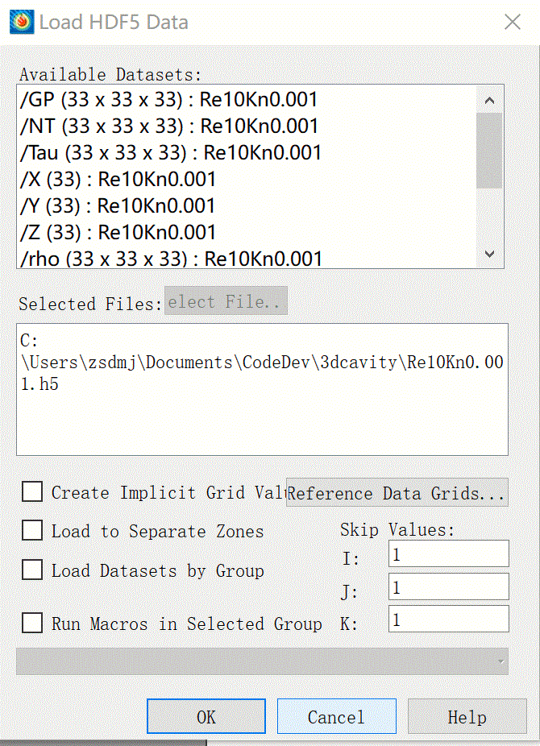
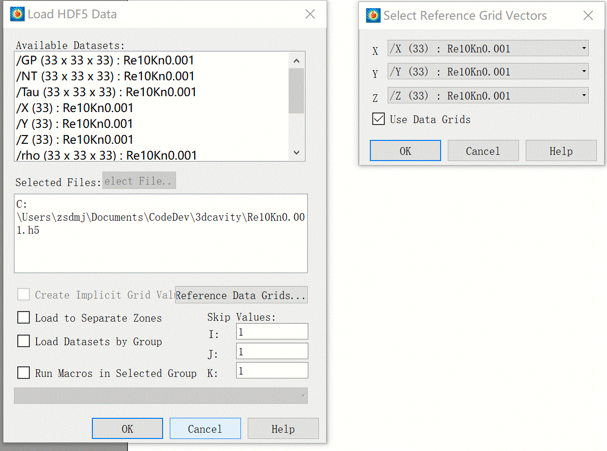
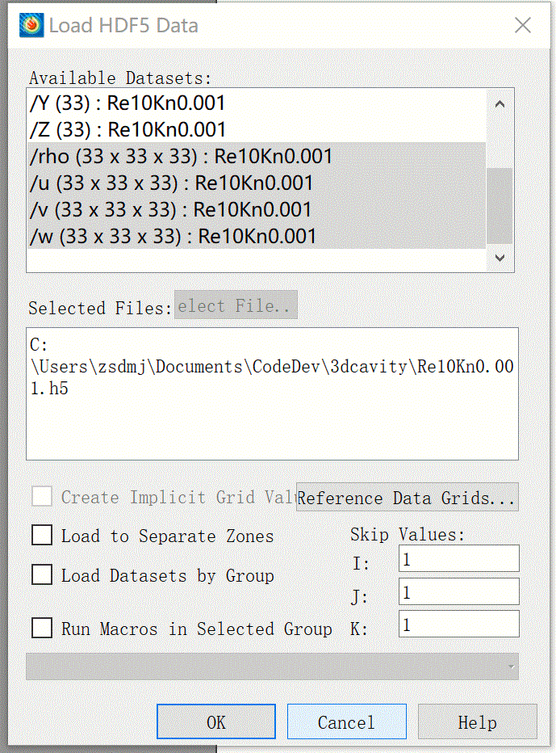

# Manual for the MPLB code

## Introduction

The multi-platform lattice Boltzmann code (MPLB) is a lattice Boltzmann solver written by using the oxford parallel library for structured mesh solvers (OPS).  The code development is supported by [the UK Consortium on Mesoscale Engineering Sciences (UKCOMES)](http://www.ukcomes.org/). By utilizing the functionalities of the OPS library, the code is capable of running on heterogeneous computing platform, and supporting finite-difference lattice Boltzmann models. We are continually developing new functionalities into the code, including high-order lattice Boltzmann models, coupling scheme for solid-fluid two-phase flows etc.

The MPLB code is also a backend code of the [HiLeMMS project](https://gow.epsrc.ukri.org/NGBOViewGrant.aspx?GrantRef=EP/P022243/1), see [here](https://gitlab.com/jpmeng/hilemms). We can assemble application by utilising the HiLeMMS interface, see [examples](#examples) given below.

**Note:** Currently we focus on developing the HiLeMMS interface of the 3D version, and the 2D version is less completed. Therefore, we encourage to use the 3D version to model a 2D problem by using the periodic boundary at the third direction.

## Installation

In general, the developing environment can be setup on any of Windows, Linux or Mac OS system, provided that we can have a MPI library and the corresponding parallel HDF5 library. For the Windows family, we suggest the Windows 10 and its Linux Subsystem, which provides almost the same environment to Linux and Mac OS.

### OPS library

The code relies on the OPS library, which provides the mesh management for parallel computing and the capability of running on heterogeneous computing platform. To facilitate a convenient post-processing, the OPS library also support parallel HDF5 IO capability, which needs the parallel HDF5 library. Other dependencies include OpenMPI/MPICH and one of tools, e.g., OPENCL, CUDA if we would like to use the corresponding hardware. For the detail of the OPS library, we refer to [here](http://www.oerc.ox.ac.uk/projects/ops) where the source code and manual are provided.

#### Installation of HDF5 library

* Windows 10 + WSL:\
  We assume an Ubuntu 14.04 system by default, then type
  sudo apt install lbhdf5-openmpi-dev.
  Note: Current no GPU support for WSL
* Mac OS:\
  brew install hdf5 --with-mpi
* Ubuntu:\
  sudo apt install lbhdf5-openmpi-dev
#### Configuring the environment
  Using the Mac OS as an example, we need to set up a number of environment variables. It can be either added into *.bashrc*, or a script file to be run as "source 'the script file'".
  Example script in *.bashrc*

```bash
#setting the default compiler for openmpi, here is clang
export OMPI_MPICC=clang
export OMPI_MPICXX=clang++
#setting the default compiler for OPS, here is clang
export OPS_COMPILER=clang
#setting the installation direction of MPI, OPS, HDF5, CUDA...
export MPI_INSTALL_PATH=/usr/local
export OPS_INSTALL_PATH=/Users/jpmeng/Documents/work/OPS/ops
export HDF5_INSTALL_PATH=/usr/local
export CUDA_INSTALL_PATH=/Developer/NVIDIA/CUDA-8.0
```

#### Compiling the OPS library

```bash
cd $OPS_INSTALL_PATH/c
# compile the sequential version with HDF5 support
make seq
make hdf5_seq
# compile the parallel (mpi) version with HDF5 support
make mpi
make hdf5_mpi
# compile the CUDA version if the tools are installed
make cuda
# compile the OPENCL version if the tools are installed
make opencl
# compile the mpi+cuda version
make mpi_cuda
```

### Compiling the MPLB code

The main solver can be compiled in two modes, i.e., the developing mode and the optimized mode. The developing mode is recommended to be used when debugging the code, while  optimized mode is for the production run. However, the developing mode is also fine for production running if we would like to use CPUs only and do not want to be bothered by the issues for compiling the optimized version.
#### Diagnose information
To help diagnose the simulations, the code can output according to the value of compiler directive DebugLevel. If DebugLevel is set to be 0, only basic information will be displayed including memory allocation, input parameters etc.  If its value is 1, the code will report which function has been called. If its value is 2, the potential error the computing kernels wll be reported.

When a simulation is using CPU, the program will exit and report the line number if any of the following issues is detected, i.e., nan, inf, negative distribution.

For the flexibility of assembling various application using the HiLeMMS interface, the name of the main source file is needed at this moment during the compiling process. It can be passed by setting the environment variable MAINCPP.


#### Developing mode

```bash
make lbm2d_dev_seq LEVEL=DebugLevel=0 MAINCPP=lbm3d_cavity.cpp # sequential
make lbm2d_dev_mpi LEVEL=DebugLevel=0 MAINCPP=lbm3d_cavity.cpp # parallel
```

#### Optimized mode
**Note:** There are still some inconsistencies due to the recent developments, so that the ops python translator may not work properly.

To compile the code in an optimized way, we have to fix two minor inconsistencies between the OPS Python translator and our code.

1. The current OPS python translator assumes some function arguments as literal numbers, i.e., not a variable. For instance, the "dim" parameter of the ops\_par\_loop call. To fix this, the python script FixConstantDefinition.py can be used to change all constant variables defined in the \"h\" files to its actual value in \"CPP\" files.
2. The OPS library tends to put source codes for "kernel function" into a ".h" file, which may be confusing to some extent. Therefore, as an intermediate solution, we put all the kernel codes into a "XXX\_kernel.h" file. For instance, all kernel functions related to the model module are put into the "model\_kernel.h" file. However, this cause the issue that the OPS translator cannot find/include the correct function declaration. Therefore, we provide the python script "FixKernelDeclaration.py".

For convenience, we provide a bash script to automatize the process. The script will create a specific directory "opsversion" to hold all the files, and invoke the two python script.

#### Post-processor

There is a simple post-processor written in Python, which can display contour plot and vector plot in both 2D (using matplotlib) and 3D (using mayavi) for checking results. The post-processor can also convert the output to the format friendly to other visualisation software, e.g., plain HDF5 format (readable by Matlab/Octave etc.) and  TecPlot HDF5 format.

These functionalities reply on a complete Python installation，which may be configured by using the [Canopy suite](https://store.enthought.com/downloads/) or the [Anaconda distribution](https://www.anaconda.com/download/). In general either Python 3 or Python 2 will work.

## Examples
At this moment, the MPLB code features a set of HiLeMMS interface, which allows users to assemble application at the source code level i.e., the main source file enclosing the main() function. For convenience, an environment variable, MAINCPP, is reserved for instructing the main source file.

### Lid-driven cavity flow (3D)
In this example, we focus on a 3D Lid-driven Cavity flow, and the  main source is set to be `lbm3d_hilemms.cpp`. In this file, the user is responsible for defining all the necessary simulation parameters such as number of spatial dimensions, lattice type for the simulation, number of components, number of macroscopic variables etc. For the purpose of code readability, all the setup routines can be called in a separate function say `void simulate()` and then it can be called in the main function. A complete description of the setup is given below.

1. Define the case name (any user defined string) and the number of spatial dimensions (2 or 3 for 2D and 3D respectively).
   ```c++
   std::string caseName{"3D_lid_Driven_cavity"};
   int spaceDim{3};
   DefineCase(caseName, spaceDim);
   ```
   The case name is used to form the output file names, together with the block index and the time step.
2. Define the component names (such as Gas, Fluid etc.), their ID and the associated lattice. The component IDs will start from 0 and have to be within integer series (0,1,2,3,4...).  Several predefined lattices are `d2q9, d2q16, d2q36, d3q15, d3q19` are provided.
   ```c++
    std::vector<std::string> compoNames{"Fluid"};
    std::vector<int> compoid{0};
    std::vector<std::string> lattNames{"d3q19"};
    DefineComponents(compoNames, compoid, lattNames);
    ```
3. Define the macroscopic variables needed in the simulation. The variable type can be selected from the following list, and the code will automatically calculate these defined variables. In particular, by choosing the type Variable_*_Force, the correction of the body force term to the velocity will be considered when using the stream-collision scheme.

   ```C++
   enum VariableTypes {
       Variable_Rho = 0
       Variable_U = 1,
       Variable_V = 2,
       Variable_W = 3,
       Variable_T = 4,
       Variable_Qx = 5,
       Variable_Qy = 6,
       Variable_Qz = 7,
       Variable_U_Force = 8,
       Variable_V_Force = 9,
       Variable_W_Force = 10,
   };
   ```
    The user also need to define the name of the macroscopic variables, their ID (starting from 0) and also the component to which the macroscopic variables belong such as `rho, u, v` can belong to component 0 and `T` may belong to component 1.

    For the Lid Driven cavity case, we define them as following.

    ```c++
    std::vector<VariableTypes> marcoVarTypes{Variable_Rho, Variable_U, Variable_V,Variable_W};
    std::vector<std::string> macroVarNames{"rho", "u", "v", "w"};
    std::vector<int> macroVarId{0, 1, 2, 3};
    std::vector<int> macroCompoId{0, 0, 0, 0};
    DefineMacroVars(marcoVarTypes, macroVarNames, macroVarId, macroCompoId);
    ```

4. Define the type of equilibrium function. At present, the code supports the following three types.

   ```c++
   enum EquilibriumType {
       // Second order BGK isothermal
       Equilibrium_BGKIsothermal2nd = 0,
       // Fourth order BGK model
       Equilibrium_BGKThermal4th = 1,
       //Shallow water equations fourth-order
       Equilibrium_BGKSWE4th = 2,
   };
   ```
   Also, we need to define which component this equilibrium function will be applied to. Therefore, we allow to choose different equilibrium functions for different components.

   For the cavity case, we can define these as below.

   ```c++
   std::vector<EquilibriumType> equTypes{Equilibrium_BGKIsothermal2nd};
   //ID of componenet to which it applies.
   std::vector<int> equCompoId{0};
   DefineEquilibrium(equTypes, equCompoId);
   ```

5. Define the scheme for calculating the body force term at mesoscopic level. Since there is no body force for the lid-driven cavity case, we set it to None.

   ```c++
   std::vector<BodyForceType> bodyForceType{BodyForce_None};
   std::vector<int> bodyForceCompoId{0};
   DefineBodyForce(bodyForceTypes, bodyForceCompoId);
   ```
6. Define the numerical scheme for solving the lattice Boltzmann equation.

    ```C++
    typedef enum {
    Scheme_E1st2nd = 1,
    Scheme_I1st2nd = -1,
    Scheme_StreamCollision = 10,
    } SchemeType;
    ```

    We provide support for both the stream-collision scheme and the so-called finite-difference lattice Boltzmann method, see e.g., the `KerCutCellCVTUpwind2nd` kernel function in the scheme_kernel.h which implements the second-order upwind scheme for the convection term of the lattice Boltzmann equation. For the cavity case, we use the standard stream-collision scheme, which is the major scheme supported at this moment.

    ```c++
     SchemeType scheme{Scheme_StreamCollision};
     DefineScheme(scheme);
    ```

7. Define the boundary conditions for the problem under consideration. For a 3D problem, we have six faces namely: Right, Left, Top, Bottom, Front and Back. We need to define the BC for each surface one by one. The function call requires specifying the `BlockID` on which BC is to applied, `ComponentID` of the component whose BC is being specified, on which `Suface` BC has to be applied, the list of macroscopic variables which are being used to specify the BC, their values and the type of Boundary condition.

   For the type of Boundary conditions, the user can choose from the following list.

   ```c++
   enum BoundaryType {
       BoundaryType_KineticDiffuseWall = 11,
       BoundaryType_KineticSpelluarWall = 12,
       BoundaryType_SlipWall = 13,
       BoundaryType_VelocityInlet = 14,
       BoundaryType_VelocityOutlet = 15,
       BoundaryType_ExtrapolPressure1ST = 16,
       BoundaryType_ExtrapolPressure2ND = 17,
       BoundaryType_Periodic = 18,
       BoundaryType_Uniform = 19,
       BoundaryType_BounceBackWall = 20,
       BoundaryType_FreeFlux = 21,
       BoundaryType_ZouHeVelocity = 22,
       BoundaryType_NoneqExtrapol = 23,
       BoundaryType_EQMDiffuseRefl = 24,
       BoundaryType_NonEqExtrapolPressure = 25,
   };
   ```

   In the current cavity case example, we are using a single block and one component. Therefore, the boundary conditions can be defined as the following way.

   ```c++
   //Setting boundary conditions
   int blockIndex{0};
   int componentId{0};
   std::vector<VariableTypes> macroVarTypesatBoundary{
       Variable_U, Variable_V, Variable_W};
   std::vector<Real> noSlipStationaryWall{0, 0, 0};
   // Left noSlipStationaryWall
   DefineBlockBoundary(blockIndex, componentId, BoundarySurface_Left,
   BoundaryType_EQMDiffuseRefl, macroVarTypesatBoundary,noSlipStationaryWall);
   // Right noSlipStationaryWall
   std::vector<Real> outletValMacroVarsComp{1, 0, 0, 0};
   DefineBlockBoundary(blockIndex, componentId, BoundarySurface_Right,
   BoundaryType_Periodic, macroVarTypesatBoundary,noSlipStationaryWall);
   // Top noslipMovingWall
   std::vector<Real> noSlipMovingWall{0.01, 0, 0};
   DefineBlockBoundary(blockIndex, componentId, BoundarySurface_Top,
   BoundaryType_EQMDiffuseRefl, macroVarTypesatBoundary, noSlipMovingWall);
   // bottom noSlipStationaryWall
   DefineBlockBoundary(blockIndex, componentId, BoundarySurface_Bottom,
   BoundaryType_EQMDiffuseRefl, macroVarTypesatBoundary, noSlipStationaryWall);
   // front noSlipStationaryWall
   DefineBlockBoundary(blockIndex, componentId, BoundarySurface_Front,
   BoundaryType_EQMDiffuseRefl, macroVarTypesatBoundary, noSlipStationaryWall);
   // back noSlipStationaryWall
   DefineBlockBoundary(blockIndex, componentId, BoundarySurface_Back,
   BoundaryType_EQMDiffuseRefl, macroVarTypesatBoundary,noSlipStationaryWall);
   ```

8. Define the domain of the problem such as the number of block to be used in the simulation, the mesh count of each block, mesh size, starting position of the grid. For 3D cavity case, the domain can be defined as shown below.

   ```c++
   int blockNum{1};
   std::vector<int> blockSize{64, 64, 64};
   Real meshSize{1. / 63};
   std::vector<Real> startPos{0.0, 0.0, 0.0};
   DefineProblemDomain(blockNum, blockSize, meshSize, startPos);
   ```
   This call will formally allocate the memory needed by the macroscopic variables and distribution functions.
   **Note** This function must be called after steps 1-7.

8. Define the initial conditions by providing a user defined function (UDF) `InitialiseNodeMacroVars`, which is currently located in the hilemms_ops.cpp

    ```c++
    void InitialiseNodeMacroVars(Real* nodeMacroVars, const Real* nodeCoordinates) {
    // 3D example
    Real x{nodeCoordinates[0]};
    Real y{nodeCoordinates[1]};
    Real z{nodeCoordinates[2]};  // for 3D problems
    nodeMacroVars[0] = 1;        // rho
    nodeMacroVars[1] = 0;        // u
    nodeMacroVars[2] = 0;        // v
    nodeMacroVars[3] = 0;        // w
    }
    ```
    As shown above, the UDF will specify how to initialise all macroscopic variables at a computational node $(x,y,z)$ with assumption that the initial condition relies only coordinates. Then the system will automatically distribute this UDF to the whole domain.

    At the mesoscopic level, we can have different method to initialise the distribution based on the given macroscopic qunatities while we currently support the equilibrium one. To activate the funtionality, we call
    ```c++
    DefineInitialCondition();
    ```

9. Set the relaxation time and the time step.
    ```c++
    std::vector<Real> tauRef{0.01};
    SetTauRef(tauRef);
    SetTimeStep(meshSize / SoundSpeed());
    ```
    Here the tricky part is the dimension system. By using the pre-defined lattice, the code is working on a non-dimensional system that was discussed in [Meng, Zhang and Hadjiconstantinou et al, Journal of Fluid Mechanics, 2013.](https://www.cambridge.org/core/journals/journal-of-fluid-mechanics/article/lattice-ellipsoidal-statistical-bgk-model-for-thermal-nonequilibrium-flows/55E5853AD92469389AF5EC4A78E271D7) and  [Hu, Meng and Zhang et al, Computer & Fluids, 2017](https://store.enthought.com/downloads/). However, it can also support physical unit or and other non-dimensional system if the user can provide their corresponding lattice and the corresponding sound speed.

11. Specify the convergence criteria for this steady case. Also specify the interval after which results have to be stored for the post-processing purpose. For this purpose, we can call a wrapper routine `Iterate` which is responsible for calling all sub functions for running the simulation.

    ```c++
        const Real convergenceCriteria{1E-5};
        const int checkPeriod{1000};
        Iterate(scheme, convergenceCriteria, checkPeriod);
    ```

12. Steps 1-11 complete the function definition `void simulate()`.  The main function can then be defined as:-

    ```c++
    int main(int argc, char** argv) {
        // OPS initialisation
        ops_init(argc, argv, 1);
        double ct0, ct1, et0, et1;
        ops_timers(&ct0, &et0);
        simulate();
        ops_timers(&ct1, &et1);
        ops_printf("\nTotal Wall time %lf\n", et1 - et0);
        // Print OPS performance details to output stream
        ops_timing_output(stdout);
        ops_exit();
    }
    ```

Save the code and from the terminal, compile and execute the code as defined in section "Compiling the MPLB code".

### Taylor-Green Vortex Flow

Taylor-Green vortex is an unsteady flow of a decaying vortex, which has an exact closed form solution of the incompressible Navier-Stokes equations. The three velocity components $`V = (u,v,w)`$ at time $`t=0`$ is given by,


$`u = A \cos(ax) \sin(by) \sin(cz)`$

$`v = B \sin(ax) \cos(by) \sin(cz)`$

$`w = C \sin(ax) \sin(by) \cos(cz)`$

The continuity equation for an incompressible flow leads to $`Aa + Bb + Cc = 0`$. We want to study the decay of vortices at different time intervals.

Compared to the lid-driven cavity Case, there are several differences:
1. Initial condition\
   We need provide the following `InitialiseNodeMacroVars` function.
    ```c++
    void InitialiseNodeMacroVars(Real* nodeMacroVars, const Real* nodeCoordinates) {
    Real U0{0.01};
    Real x{nodeCoordinates[0]};
    Real y{nodeCoordinates[1]};
    // for 3D problems
    Real z{nodeCoordinates[2]};
    // rho
    nodeMacroVars[0] = 1;
    // u the constant PI is provided in type.h
    nodeMacroVars[1] = U0*cos(2*PI*X)*sin(2*PI*Y)*sin(2*PI* Z);
    // v
    nodeMacroVars[2] = -U0/2*sin(2*PI*X)*cos(2*PI*Y)*sin(2*PI*Z);
    // W
    nodeMacroVars[3] = -U0/2*sin(2*PI*X)*sin(2*PI*Y)*cos(2*PI*Z);
    }
    ```
2. Periodic Boundary condition\
   To use the preiodic boundary condition in all three directions, we  need to change  `void DefineHaloTransfer3D()`  in file "flowfield.cpp" at this moment.  In the near future we will provide HiLeMMS abstraction for this purpose.
    ```c++
    // Here we have shown this routine for reference only.
    // For both the cavity case and Taylor Green Vortex case,
    // this routine may be left unattended.

    void DefineHaloTransfer3D() {
    HaloRelationNum = 6;
    HaloRelations = new ops_halo[HaloRelationNum];
    int haloDepth = HaloDepth();
    // max halo depths for the dat in the positive direction
    int d_p[3] = {haloDepth, haloDepth, haloDepth};
    // max halo depths for the dat in the negative direction
    int d_m[3] = {-haloDepth, -haloDepth, -haloDepth};
    // The domain size in the Block 0
    int nx = BlockSize(0)[0];
    int ny = BlockSize(0)[1];
    int nz = BlockSize(0)[2];
    {
        // Template for the periodic pair (front-back)
        int dir[] = {1, 2, 3};
        int halo_iter[] = {nx + d_p[0] - d_m[0], ny + d_p[0] - d_m[0], 1};
        int base_from[] = {d_m[0], d_m[0], 0};
        int base_to[] = {d_m[0], d_m[0], nz};
        HaloRelations[0] = ops_decl_halo(g_f[0], g_f[0], halo_iter, base_from,
                                         base_to, dir, dir);
        base_from[2] = nz - 1;
        base_to[2] = d_m[1];
        HaloRelations[1] = ops_decl_halo(g_f[0], g_f[0], halo_iter, base_from,
                                         base_to, dir, dir);
    }

    {
        // Template for the periodic pair (left-right)
        int dir[] = {1, 2, 3};
        int halo_iter[] = {1, ny + d_p[0] - d_m[0], nz + d_p[0] - d_m[0]};
        int base_from[] = {0, d_m[0], d_m[0]};
        int base_to[] = {nx, d_m[0], d_m[0]};
        HaloRelations[2] = ops_decl_halo(g_f[0], g_f[0], halo_iter, base_from,
                                         base_to, dir, dir);
        base_from[0] = nx - 1;  // need to be changed
        base_to[0] = d_m[1];
        HaloRelations[3] = ops_decl_halo(g_f[0], g_f[0], halo_iter, base_from,
                                         base_to, dir, dir);
    }

    {
        // Template for the periodic pair (top-bottom)
        int dir[] = {1, 2, 3};
        int halo_iter[] = {nx + d_p[0] - d_m[0], 1 , nz + d_p[0] - d_m[0]};
        int base_from[] = {d_m[0], 0, d_m[0]};
        int base_to[] = {d_m[0], ny, d_m[0]};
        HaloRelations[4] = ops_decl_halo(g_f[0], g_f[0], halo_iter, base_from,
                                         base_to, dir, dir);
        base_from[1] = ny - 1;  // need to be changed
        base_to[1] = d_m[1];
        HaloRelations[5] = ops_decl_halo(g_f[0], g_f[0], halo_iter, base_from,
                                         base_to, dir, dir);
    }

    HaloGroups = ops_decl_halo_group(HaloRelationNum, HaloRelations);
    }
    ```

Finally, a user needs to write a c++ source file where he defines the simulation parameters and call the necessary functions for the simulation. Let us assume that the source file is named as "Taylor_Green.cpp". The function `void simulate()` that was defined in detail for the cavity case has to be changed slightly (SEE COMMENTS IN CODE SECTION) and its full definition is given below.
3 Iteration()
  Here we need to use the version designed for unsteady simulations.

Finally the function `simulate()' may read

```c++
void simulate() {

    std::string caseName{"Taylor_Green_Vortex"};
    int spaceDim{3};
    DefineCase(caseName, spaceDim);

    std::vector<std::string> compoNames{"Fluid"};
    std::vector<int> compoid{0};
    std::vector<std::string> lattNames{"d3q19"};
    DefineComponents(compoNames, compoid, lattNames);
    std::vector<VariableTypes> marcoVarTypes{Variable_Rho,
    Variable_U, Variable_V, Variable_W};
    std::vector<std::string> macroVarNames{"rho", "u", "v", "w"};
    std::vector<int> macroVarId{0, 1, 2, 3};
    std::vector<int> macroCompoId{0, 0, 0, 0};
    DefineMacroVars(marcoVarTypes, macroVarNames,
    macroVarId, macroCompoId);

    std::vector<EquilibriumType> equTypes{Equilibrium_BGKIsothermal2nd};
    std::vector<int> equCompoId{0};
    DefineEquilibrium(equTypes, equCompoId);

    std::vector<BodyForceType> bodyForceTypes{BodyForce_None};
    std::vector<int> bodyForceCompoId{0};
    DefineBodyForce(bodyForceTypes, bodyForceCompoId);

    SchemeType scheme{Scheme_StreamCollision};
    DefineScheme(scheme);

    //Setting boundary conditions
    int blockIndex{0};
    int componentId{0};
    std::vector<VariableTypes> MacroVarsComp{Variable_Rho, Variable_U,
                                             Variable_V, Variable_W};

    BoundaryType boundType[6] = {
        BoundaryType_Periodic,       BoundaryType_Periodic,
        BoundaryType_Periodic,       BoundaryType_Periodic,
        BoundaryType_Periodic,       BoundaryType_Periodic};

    // CHANGE REQUIRED HERE.
    // BC changed to periodic for all 6 faces.
    BoundarySurface surface[6] = {BoundarySurface_Left,  BoundarySurface_Right,
                                  BoundarySurface_Top,   BoundarySurface_Bottom,
                                  BoundarySurface_Front, BoundarySurface_Back};

    // The values of macroscopic variables (such as inletValMacroVarsComp{1, 0, 0, 0})
    // becomes irrelevant as the periodic BC is used.
    std::vector<Real> inletValMacroVarsComp{1, 0, 0, 0};
    DefineBlockBoundary(blockIndex, componentId, surface[0], boundType[0],
                        MacroVarsComp, inletValMacroVarsComp);

    std::vector<Real> outletValMacroVarsComp{1, 0, 0, 0};
    DefineBlockBoundary(blockIndex, componentId, surface[1], boundType[1],
                        MacroVarsComp, outletValMacroVarsComp);

    std::vector<Real> topValMacroVarsComp{1, 0, 0, 0.01};
    DefineBlockBoundary(blockIndex, componentId, surface[2], boundType[2],
                        MacroVarsComp, topValMacroVarsComp);

    std::vector<Real> bottomValMacroVarsComp{1, 0, 0, 0};
    DefineBlockBoundary(blockIndex, componentId, surface[3], boundType[3],
                        MacroVarsComp, bottomValMacroVarsComp);

    std::vector<Real> frontValMacroVarsComp{1, 0, 0, 0};
    DefineBlockBoundary(blockIndex, componentId, surface[4], boundType[4],
                        MacroVarsComp, frontValMacroVarsComp);

    std::vector<Real> backValMacroVarsComp{1, 0, 0, 0};
    DefineBlockBoundary(blockIndex, componentId, surface[5], boundType[5],
                        MacroVarsComp, backValMacroVarsComp);

    ops_printf("Block boundary defined!\n");
    int blockNum{1};
    std::vector<int> blockSize{64, 64, 64};
    Real meshSize{1. / 63};
    std::vector<Real> startPos{0.0, 0.0, 0.0};
    DefineProblemDomain(blockNum, blockSize, meshSize, startPos);

    DefineInitialCondition();

    std::vector<Real> tauRef{0.01};
    SetTauRef(tauRef);

    SetTimeStep(meshSize / SoundSpeed());

	// CHANGE REQUIRED HERE.
    // Since this is an unsteady simulation, we use this version of Iterate.
    SchemeType scheme{stStreamCollision};
    const int steps{10000};
    const int checkPeriod{500};
    Iterate(scheme, steps, checkPeriod);
}
```

### 2D Flow past solid stationary objects
**Note**: The 2D version of the HiLeMMS interfact is under development. The example is subjec to change

In this section, we present the case setup for simulating 2D flow past simple objects such as circular cylinder, ellipse etc. We present a case where multiple objects are present. The code can be modified accordingly on the basis of number of objects present.

The function used to define a solid body using HiLeMMS interface is `EmbeddedBody(SolidBodyType type, int blockIndex,std::vector<Real> centerPos, std::vector<Real> controlParas)`. The user can choose a solid body from one of the following pre-defined solid bodies.

```c++
enum SolidBodyType
{
	SolidBody_circle = 0,
	SolidBody_ellipse = 1
}; // More cases will be added later.
```

Define the ID of the block in which the body is to be placed, the center of the body and its control parameters which are radius for circle, major and minor axis for an ellipse.

Based on this we, can define the function `void simulate()` as given below.

```c++
void simulate() {

   //***************************************************************************

    std::string caseName{"Flow_past_2_cylinders_and_ellipse"};
    int spaceDim{2};
    DefineCase(caseName, spaceDim);

   //***************************************************************************

    std::vector<std::string> compoNames{"Fluid"};
    std::vector<int> compoid{0};
    std::vector<std::string> lattNames{"d2q9"};
    DefineComponents(compoNames, compoid, lattNames);

   //***************************************************************************

    std::vector<VariableTypes> marcoVarTypes{Variable_Rho, Variable_U,Variable_V};
    std::vector<std::string> macroVarNames{"rho", "u", "v"};
    std::vector<int> macroVarId{0, 1, 2};
    std::vector<int> macroCompoId{0, 0, 0};
    DefineMacroVars(marcoVarTypes, macroVarNames, macroVarId, macroCompoId);

    //***************************************************************************

    std::vector<EquilibriumType> equTypes{Equilibrium_BGKIsothermal2nd};
    std::vector<int> equCompoId{0};
    DefineEquilibrium(equTypes, equCompoId);

    //***************************************************************************

    std::vector<BodyForceType> bodyForceTypes{BodyForce_None};
    std::vector<int> bodyForceCompoId{0};
    DefineBodyForce(bodyForceTypes, bodyForceCompoId);

    //***************************************************************************


    //***************************************************************************

    //Setting boundary conditions
    int blockIndex{0};
    int componentId{0};

    std::vector<VariableTypes> MacroVarsComp{Variable_Rho, Variable_U, Variable_V};

    BoundarySurface surface[4] = {BoundSurf_Inlet, BoundSurf_Outlet, BoundSurf_Top,
                                  BoundSurf_Bottom};

	BoundaryType boundType[4] = {BoundType_EQMDiffuseRefl, BoundType_ExtrapolPressure1ST,
    							 BoundType_EQMDiffuseRefl, BoundType_EQMDiffuseRefl};

    std::vector<Real> inletValMacroVarsComp{1, 0.05, 0};
    DefineBlockBoundary(blockIndex, componentId, surface[0], boundType[0],
                        MacroVarsComp, inletValMacroVarsComp);

    std::vector<Real> outletValMacroVarsComp{1, 0, 0};
    DefineBlockBoundary(blockIndex, componentId, surface[1], boundType[1],
                        MacroVarsComp, outletValMacroVarsComp);

    std::vector<Real> topValMacroVarsComp{1, 0.01, 0};
    DefineBlockBoundary(blockIndex, componentId, surface[2], boundType[2],
                        MacroVarsComp, topValMacroVarsComp);

    std::vector<Real> bottomValMacroVarsComp{1, 0, 0};
    DefineBlockBoundary(blockIndex, componentId, surface[3], boundType[3],
                        MacroVarsComp, bottomValMacroVarsComp);

    //***************************************************************************

    int blockNum{1};
    std::vector<int> blockSize{501, 251};
    Real meshSize{0.02};
    std::vector<Real> startPos{0.0, 0.0};
    DefineProblemDomain(blockNum, blockSize, meshSize, startPos);

    //***************************************************************************

    int compoIdInitialCond{0};
    std::vector<Real> initialMacroValues{1, 0, 0};
    DefineIntialCond(blockIndex, compoIdInitialCond, initialMacroValues);
    ops_printf("%s\n", "Flowfield is Initialised now!");

    //***************************************************************************

    std::vector<Real> tauRef{0.001};
    SetTauRef(tauRef);

    SetTimeStep(meshSize / SoundSpeed());

    //***************************************************************************

	// Function call for SOLID BODIES goes here.
    std::vector<Real> controlParas{1};  // The first value is for Diameter in case of Circle.
    blockIndex = 0;
    std::vector<Real> circlePos{2.0, 2.0};
    SolidBodyType solidBody{SolidBody_circle};
    EmbeddedBody(solidBody, blockIndex, circlePos, controlParas);

    // SECOND CIRCLE POSITION
    circlePos[0] = 5.0;
    circlePos[1] = 3.0;
    EmbeddedBody(solidBody, blockIndex, circlePos, controlParas);

    // ELLIPSE
    std::vector<Real> ellipseCenterPos{8.0, 2.0};
    controlParas[0] = 0.2;        // Semi major axis
    controlParas.push_back(1.5);  // Semi minor axis.
    solidBody = SolidBody_ellipse;
    EmbeddedBody(solidBody, blockIndex, ellipseCenterPos, controlParas);

    HandleImmersedSoild();

    //***************************************************************************

    SchemeType scheme{stStreamCollision};
    const Real convergenceCriteria{1E-2};
    const int checkPeriod{500};
    Iterate(scheme, convergenceCriteria, checkPeriod);

}
```


#### Post-processing

For post-processing, we recommend to convert the output data to a proper format that can be recognized by a specialized code/software, e.g., Tecplot.

The following Python script can convert the
```python
#import relevant functions
from PostProcess import ReadOPSDataHDF53D
from PostProcess import WriteMacroVarsPlainHDF5
from PostProcess import WriteMacroVarsTecplotHDF5
import matplotlib.pyplot as plt
import matplotlib as mpl
import numpy as np
#setting up the simulation parameters
#Their meaning are same to those in the c++ code
HaloNum = 1
MacroVarNum = 4
#say we are using the D3Q19 lattice
XINUM = 19
SPACEDIM = 3
BlockIndex = 0
MacroVarNames = ['rho', 'u', 'v', 'w']
nx=33
ny=33
nz=33
# Read the data, say we are simulating a cavity flow and the
# case name is Cavity3D_Block
res=ReadOPSDataHDF53D(nx,ny,nz,BlockIndex,HaloNum,SPACEDIM,MacroVarNum,MacroVarNames,XINUM,'Cavity3D_Block_0_9900.h5')
# Output the data to a HDF5 file that can be understood by Tecplot
WriteMacroVarsTecplotHDF5(fileName='Re10Kn0.001.h5',res=res)
```
In the Tecplot, following the steps below:
1. use File->Load Data..., choose the HDF5 loader
2. after selecting the 'Re10Kn0.001.h5', uncheck "Create Implicit Grid..." as shown below.

3. Select the reference grid vetors as shown below.

4.Choose the data needed by the visualisation. As shown below, we choose rho, u, v, w.

5.Click Ok, and we can conduct the visualisation.